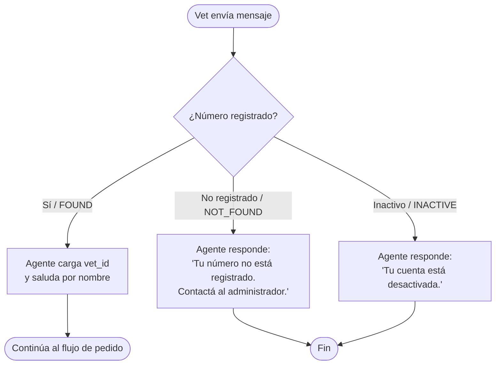
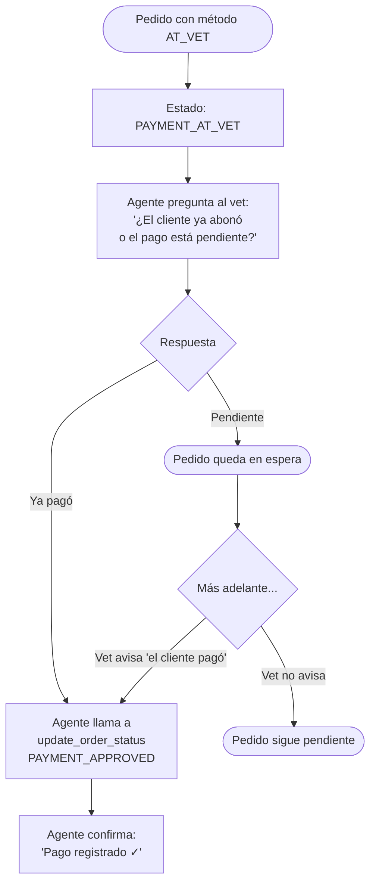
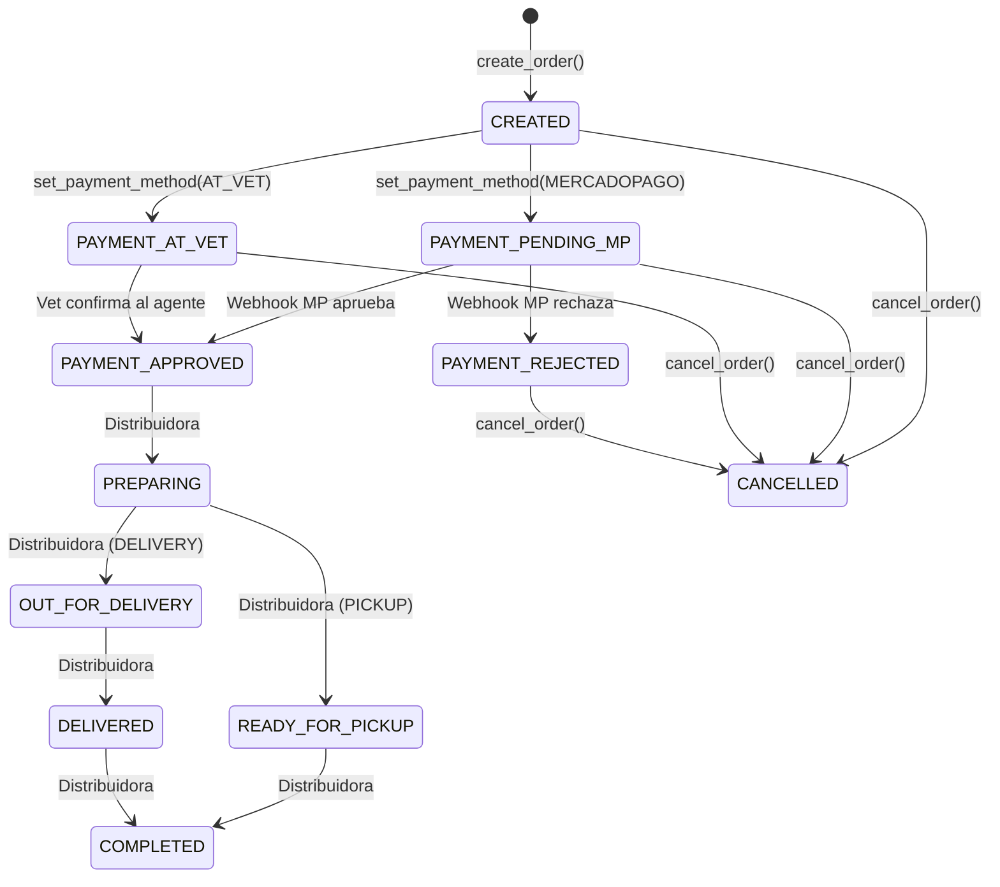

# Direct to Vet — Mapa de Flujo del Sistema

> Documento de revisión del flujo completo de interacciones entre **Veterinario**, **Agente** y **Cliente Final**.

---

## Actores

| Actor | Canal | Rol |
|-------|-------|-----|
| **Veterinario (Vet)** | WhatsApp | Opera el sistema, arma pedidos para sus clientes |
| **Agente** | WhatsApp / Twilio | IA conversacional que asiste al vet |
| **Cliente Final** | WhatsApp (solo recibe) | Dueño de mascota que recibe el link y paga |
| **Mercado Pago** | Webhook automático | Confirma pagos online |
| **Distribuidora** | Sistema externo | Gestiona logística y actualiza estados de envío |

---

## 1. Flujo de Identificación del Veterinario



---

## 2. Flujo de Conexión Mercado Pago (OAuth)

> Se ejecuta solo si el vet quiere pagar por MP y aún no conectó su cuenta.

```mermaid
flowchart TD
    A([Vet elige pago por MP]) --> B{¿Tiene MP conectado?}
    B -- Sí / mp_connected=true --> C([Continúa a generar link])
    B -- No --> D[Agente genera link OAuth\ncon start_mp_oauth()]
    D --> E[Agente envía link al vet:\n'Abrí este link para conectar tu MP']
    E --> F([Vet hace click\ny autoriza en MP])
    F --> G[Callback guarda tokens\nautomáticamente]
    G --> H[Vet avisa: 'Listo'\nAgente continúa con el pedido]
```

---

## 3. Flujo Principal de Pedido

### 3a. Recolección de datos

```mermaid
flowchart TD
    A([Vet inicia pedido]) --> B[Agente busca catálogo\nsearch_catalog()]
    B --> C[Agente muestra hasta 5 productos\ncon nombre, presentación y precio]
    C --> D[Vet elige productos y cantidades]
    D --> E[Agente agrega al carrito\nadd_to_cart()]
    E --> F{¿Más productos?}
    F -- Sí --> B
    F -- No --> G[Vet da datos del cliente final:\nnombre, email, WhatsApp]
    G --> H{¿Cliente ya registrado?}
    H -- Sí --> I[Agente pre-carga datos\ndesde search_customer()]
    H -- No --> J[Agente usa los datos provistos\ny puede registrarlo con register_customer()]
    I --> K[Vet define logística:\nPICKUP o DELIVERY]
    J --> K
    K -- PICKUP --> L[Sin costo de envío]
    K -- DELIVERY --> M[Vet da dirección y localidad\nAgente calcula costo de envío]
    L --> N[Vet define método de pago:\nMercado Pago o En Mostrador]
    M --> N
```

### 3b. Confirmación y creación

```mermaid
flowchart TD
    A([Datos completos]) --> B[Agente presenta resumen:\n- Cliente\n- Items con precios\n- Logística y costo\n- Método de pago\n- Total\n¿Lo confirmo?]
    B --> C{Respuesta del vet}
    C -- Confirma\nsí / dale / ok --> D[Agente crea pedido\ncreate_order()]
    C -- Pide cambio --> E[Agente ajusta datos\ny vuelve a mostrar resumen]
    E --> B
    C -- Cancela --> F([Pedido descartado])
    D --> G[Agente llama a\nset_payment_method()]
    G --> H{Método de pago}
    H -- MERCADOPAGO --> I([Ver Flujo 4A])
    H -- AT_VET --> J([Ver Flujo 4B])
```

---

## 4A. Flujo de Pago — MercadoPago

```mermaid
flowchart TD
    A([Pedido con método MERCADOPAGO]) --> B{¿MP conectado?}
    B -- No --> C[Agente inicia OAuth\nver Flujo 2]
    C --> B
    B -- Sí --> D[Agente genera link de pago\ncreate_payment_link()]
    D --> E[Agente envía link al CLIENTE\nsend_payment_link_to_customer()\nvía plantilla de WhatsApp aprobada]
    E --> F[Agente confirma al vet:\n'Link enviado a Cliente al +549...']
    F --> G([Estado: PAYMENT_PENDING_MP])
    G --> H{¿Qué pasa en MP?}
    H -- Pago aprobado --> I[Webhook automático\nde Mercado Pago]
    H -- Pago rechazado --> J[Webhook notifica rechazo]
    H -- Sin respuesta --> K([Pedido queda pendiente])
    I --> L[Sistema actualiza estado:\nPAYMENT_APPROVED]
    I --> M[Agente notifica al CLIENTE:\n'Tu pago fue confirmado 🎉']
    I --> N[Agente notifica al VET:\n'Pago recibido para ORD-XXXXX']
    J --> O[Estado: PAYMENT_REJECTED]
    J --> P[Agente notifica al vet\npara gestionar reintento]
```

---

## 4B. Flujo de Pago — En Mostrador (AT_VET)



---

## 5. Flujo de Logística Post-Pago

> Una vez que el pago está aprobado, la logística la maneja **la distribuidora**, no la veterinaria.

```mermaid
flowchart TD
    A([PAYMENT_APPROVED]) --> B{Modo de entrega}
    B -- PICKUP --> C[Estado: PREPARING]
    B -- DELIVERY --> C
    C --> D[Estado: READY_FOR_PICKUP\no OUT_FOR_DELIVERY]
    D --> E[Estado: DELIVERED]
    E --> F[Estado: COMPLETED]

    G([Distribuidora]) -. actualiza estados .-> C
    G -. actualiza estados .-> D
    G -. actualiza estados .-> E
    G -. actualiza estados .-> F

    H([Veterinaria]) -- solo puede --> I[CANCELAR pedido\ncon cancel_order()]
    I -. notifica automáticamente .-> J([Cliente recibe\nWhatsApp de cancelación])
```

---

## 6. Mapa de Notificaciones

| Evento | Notificado | Canal | Quién lo dispara |
|--------|-----------|-------|-----------------|
| Link de pago generado | Cliente Final | WhatsApp (plantilla) | Agente |
| Pago aprobado (MP) | Cliente Final | WhatsApp | Sistema (webhook MP) |
| Pago aprobado (MP) | Veterinario | WhatsApp | Sistema (webhook MP) |
| Pedido cancelado | Cliente Final | WhatsApp | Sistema (cancel_order) |
| Pago en mostrador confirmado | — | — | Vet confirma al agente |

---

## 7. Estados del Pedido



---

## 8. Resumen de Responsabilidades

```
┌─────────────────────────────────────────────────────────────────┐
│                        VETERINARIO                              │
│  • Busca productos en el catálogo                               │
│  • Arma carrito para su cliente                                 │
│  • Provee datos del cliente (nombre, email, WhatsApp)           │
│  • Define logística (pickup / delivery)                         │
│  • Define método de pago (MP / mostrador)                       │
│  • Confirma el pedido antes de crearlo                          │
│  • Confirma pagos en mostrador                                  │
│  • Puede cancelar pedidos                                       │
└─────────────────────────────────────────────────────────────────┘
         │ WhatsApp
         ▼
┌─────────────────────────────────────────────────────────────────┐
│                          AGENTE (IA)                            │
│  • Identifica al vet por número de WhatsApp                     │
│  • Busca productos, clientes y pedidos                          │
│  • Arma y confirma pedidos                                      │
│  • Gestiona OAuth de MP                                         │
│  • Genera y envía links de pago al cliente                      │
│  • Pregunta al vet si el cliente pagó (AT_VET)                  │
│  • Actualiza estados de pago                                    │
└─────────────────────────────────────────────────────────────────┘
         │ WhatsApp (plantilla aprobada)        ▲ Webhook
         ▼                                      │
┌────────────────────────┐          ┌───────────────────────────┐
│    CLIENTE FINAL       │          │      MERCADO PAGO         │
│  • Recibe link de pago │ ─paga──▶ │  • Procesa el pago        │
│  • Recibe confirmación │          │  • Notifica al sistema    │
│  • Recibe cancelación  │          │  • Cobra en cuenta del VET│
└────────────────────────┘          └───────────────────────────┘
```

---

## Puntos a Revisar / Decisiones Pendientes

- [ ] **Reintento de pago rechazado**: ¿El agente debe ofrecer generar un nuevo link si MP rechaza?
- [ ] **Notificación de logística al cliente**: ¿El agente notifica al cliente cuando su pedido está listo o en camino?
- [ ] **Múltiples pedidos AT_VET pendientes**: ¿El agente debería listar pedidos pendientes de pago en mostrador de forma proactiva?
- [ ] **Expiración de link MP**: ¿Qué hace el agente si el link de pago expiró y el cliente no pagó?
- [ ] **Registro automático de cliente**: ¿Si el vet da datos de un cliente nuevo al crear el pedido, se registra automáticamente en la hoja de Customers?
